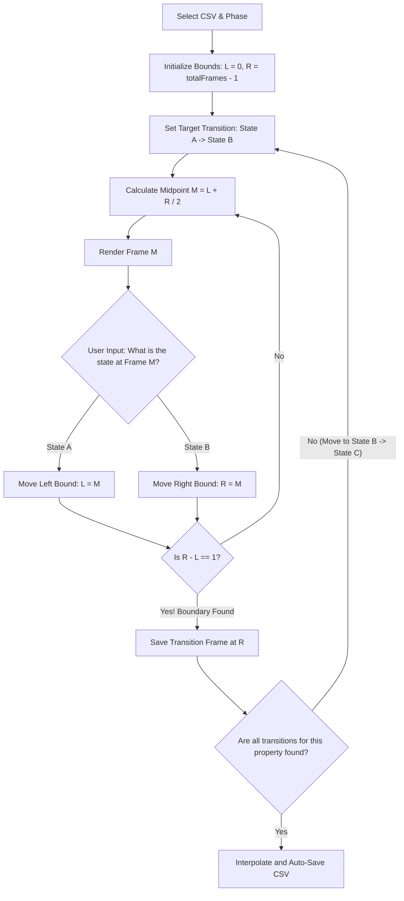

# Design: Monotonic Binary Search Transition Labeler v1 (binary_search_transition_labeler_v1)

## 1. Core Philosophy

In Mario Kart runs, **Race Phase** and **Lap Number** are strictly **monotonic variables**—they progress through a Directed Acyclic Graph (DAG) in a one-way path:
*   **Race Phase**: `start_sequence` $\rightarrow$ `racing` $\rightarrow$ `finished`
*   **Lap Number**: `lap_1` $\rightarrow$ `lap_2` $\rightarrow$ `lap_3`

Because these states never retrogress (e.g., you can never go back to `lap_1` after reaching `lap_2`), finding the exact frame where a transition occurs is a **binary search** problem. 

Instead of an annotator spending minutes scrubbing a timeline linearly to pinpoint a single transition frame, the system plays a game of **bounds-halving**. By showing a series of midpoint frames and asking simple binary questions, the tool locates any transition in $O(\log N)$ time. For an 18,000-frame run, the exact transition frame can be pinpointed in just **14 keystrokes**!

---

## 2. Core Workflow & State Machine



### The Transition DAG Configurations

The tool operates on two main pipelines:

#### Pipeline 1: Race Phase
*   **Monotonic Chain**: `pre_countdown` $\rightarrow$ `countdown` $\rightarrow$ `racing` $\rightarrow$ `finished`
*   **Transitions to Find**:
    1.  `pre_countdown` $\rightarrow$ `countdown` (Countdown begins)
    2.  `countdown` $\rightarrow$ `racing` (Green light / race starts)
    3.  `racing` $\rightarrow$ `finished` (Crosses finish line on final lap)

#### Pipeline 2: Lap Number (Dynamic Chain)
*   **Dynamic Monotonic Chain**: Configurable dynamically in the UI based on course metadata (defaults to 3 laps: `lap_unknown` $\rightarrow$ `lap_1` $\rightarrow$ `lap_2` $\rightarrow$ `lap_3` $\rightarrow$ `lap_unknown`).
*   **Transitions to Find**: $N + 1$ total sequential transitions:
    1.  `lap_unknown` $\rightarrow$ `lap_1` (Start of race / first lap begins)
    2.  `lap_1` $\rightarrow$ `lap_2`
    3.  `lap_2` $\rightarrow$ `lap_3` (and so on...)
    4.  `lap_N` $\rightarrow$ `lap_unknown` (Race finishes, laps stop tracking/reset to unknown)

---

## 3. UI/UX Design: "The Three-Frame Aperture"

To give the annotator complete cognitive clarity, the viewport displays a **Three-Frame Context Panel** side-by-side:

```
+---------------------------------------------------------------------------------+
|                                                                                 |
|   +-------------------+       +-------------------+       +-------------------+ |
|   |    LEFT ANCHOR    |       |  CURRENT MIDPOINT |       |    RIGHT ANCHOR   | |
|   |     (Frame L)     |       |     (Frame M)     |       |     (Frame R)     | |
|   |                   |       |                   |       |                   | |
|   |  State: [State A] |       |  State: ????????  |       |  State: [State B] | |
|   +-------------------+       +-------------------+       +-------------------+ |
|                                                                                 |
+---------------------------------------------------------------------------------+
|             [1] Frame M is [State A]      |     [2] Frame M is [State B]        |
+---------------------------------------------------------------------------------+
```

1.  **Left Anchor (Frame $L$)**: The latest frame *confirmed* to be in the starting state (`State A`).
2.  **Current Midpoint (Frame $M$)**: The frame the user needs to classify.
3.  **Right Anchor (Frame $R$)**: The earliest frame *confirmed* to be in the target state (`State B`).

### The Visual Indicators
As the user halves the search space, the distance between the Left and Right Anchors shrinks dynamically. A visual **Progress Bar** at the bottom of the workspace displays the total search window shrinking in real-time, giving instant satisfying feedback of the search space collapsing.

---

## 4. Keystrokes & Interface Controls

Because maximum speed is the goal, the annotator's hands never leave the keyboard:

*   **`1` or `Left Arrow`**: Classify Midpoint as `State A` (Sets $L = M$).
*   **`2` or `Right Arrow`**: Classify Midpoint as `State B` (Sets $R = M$).
*   **`Backspace` / `U`**: Undo last step (pops the previous bounds state from a history stack).
*   **`Space`**: Play a short 2-second looped preview around the midpoint frame to see motion if the frame is ambiguous (e.g. checking if the countdown timer has officially started ticking).
*   **`Tab`**: Swap between the **Race Phase** pipeline and the **Lap Number** pipeline.

---

## 5. Backend Interpolation Logic

Once a transition boundary is found at index $T$, the backend performs a bounded write to the CSV.

For example, once `start_sequence` $\rightarrow$ `racing` is found at Frame $T_1$, and `racing` $\rightarrow$ `finished` is found at Frame $T_2$:
*   Frames $[0, T_1 - 1]$ are populated with `start_sequence`.
*   Frames $[T_1, T_2 - 1]$ are populated with `racing`.
*   Frames $[T_2, \text{totalFrames} - 1]$ are populated with `finished`.

### Reconstructive API Endpoint Designs

#### 1. `GET /api/load`
Parses the active CSV. Since it's monotonic, it extracts existing transition boundaries:
*   If transitions already exist in the file, it loads them and marks that search path as complete.
*   If no transitions exist (or partial ones exist), it automatically initializes the active search window bounds.

#### 2. `POST /api/save`
Receives the completed transition frame indexes for the active column and commits the interpolated values to the raw CSV on the disk.

```typescript
interface SaveTransitionRequest {
  columnName: 'race_phase' | 'lap';
  transitions: {
    stateFrom: string;
    stateTo: string;
    transitionFrameIdx: number; // The frame where stateTo begins
  }[];
}
```

---

## 6. Project Architecture

*   **Frontend**: Next.js 15+ Static Export running on `http://localhost:3004`
*   **Backend**: Express Server running on `http://localhost:3005`
*   **Process Management**: Unified start via a root `package.json` script using `concurrently`.
---

## 7. Shared Track Metadata (textproto)

To avoid duplicating track configurations (like the number of laps or track type) across various tools, we use a single, package-level protobuf text format (`textproto`) configuration file stored inside `packages/metadata/tracks.textproto`.

### Proto Schema Extensions (`packages/types/data.proto`)
```protobuf
message RaceCourseInfoList {
  repeated RaceCourseInfo courses = 1;
}
```

### Metadata Configuration (`packages/metadata/tracks.textproto`)
```textproto
# proto-file: packages/types/data.proto
# proto-message: types.RaceCourseInfoList

courses {
  name: "Rainbow Road"
  shortened_name: RAINBOW_ROAD
  type: STANDARD_LOOP
  number_of_laps: LAP_3
}
```

### Integration Workflow
1.  **Reading Track Configurations**: The backend reads `/packages/metadata/tracks.textproto` at startup, parses the active track definition matching the CSV file's `track` column, and extracts properties like `number_of_laps`.
2.  **Dynamic Lap Transitions Generation**:
    *   If a course's `number_of_laps` is `LAP_3`, the tool automatically configures the Lap pipeline search space to look for 4 sequential boundaries:
        *   `lap_unknown` $\rightarrow$ `lap_1`
        *   `lap_1` $\rightarrow$ `lap_2`
        *   `lap_2` $\rightarrow$ `lap_3`
        *   `lap_3` $\rightarrow$ `lap_unknown`
    *   If a course's `number_of_laps` is `LAP_5`, it dynamically structures 6 sequential boundaries (`lap_unknown` $\rightarrow$ `lap_1` $\rightarrow$ ... $\rightarrow$ `lap_5` $\rightarrow$ `lap_unknown`).

