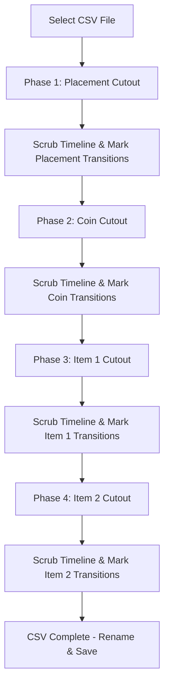

# Design: Per-Cutout Transition Labeler v1 (per_cutout_transition_labeler_v1)

## 1. Core Philosophy

The primary objective is to label frame transition boundaries with maximum speed, high visual focus, and zero cognitive overhead. 

Rather than viewing the full gameplay frame and trying to track multiple variables at once—which is mentally exhausting and error-prone—the annotator works **one property at a time** using isolated visual cutouts.

### The Labeling Sequence
Data labeling is conducted sequentially across 4 distinct visual phases:
1. **Placement** (HUD Placement text area)
2. **Coin Count** (HUD Coins count text area)
3. **Primary Item / Item 1** (HUD Primary item box)
4. **Secondary Item / Item 2** (HUD Secondary item box)

*Note: Lap count and Race Phase are handled by a separate tool and are ignored here.*

---

## 2. Core Workflow & Visual Focus



### Full-Aperture Focal-Point Zoom Viewport
Instead of aggressively cropping the video into a tiny unreadable square, the UI presents the **full 16:9 aperture** of the gameplay. The user can interactively drag Top/Left sliders to adjust the CSS `transform-origin` (the camera's focal anchor point) and increase the `scale` zoom. This allows butter-smooth panning without breaking the aspect ratio.

```css
/* Responsive 16:9 Full-Aperture Viewport */
.crop-container {
  width: 100%;
  max-width: 950px;
  aspect-ratio: 16 / 9;
  overflow: hidden;
  position: relative;
  border: 6px solid var(--active-accent); /* Dynamic color per phase */
  border-radius: 16px;
  box-shadow: 0 20px 60px var(--active-accent);
}

/* Dynamic focal-point camera zoom */
.crop-container img {
  width: 100%;
  height: 100%;
  object-fit: contain;
  /* Driven dynamically by React state */
  transform-origin: 15% 10%; 
  transform: scale(3.5);
  transition: transform 0.1s ease-out;
}
```

---

## 3. Real-Time Resumable State Preservation (Save-As-We-Go)

The tool must support **instant persistence** and **seamless resumes** if labeling is interrupted:

### 1. Saving State Mid-Flight
Every time a user adds, removes, or modifies a transition point:
- The frontend sends a `POST /api/save` request to the backend.
- The request contains the target column (e.g., `primary_item`), the changed frame index, and the new value.
- The backend immediately writes the keyframe change to the local CSV.
- The backend runs a **Forward-Fill (FFill)** propagation algorithm starting from that frame up to the next annotated keyframe, updating the CSV rows instantly.

### 2. Loading State & Starting Where You Left Off
When a CSV file is opened, the tool reconstructs the state:
- **Scan Column Transitions**: The backend parses the CSV and automatically identifies the marked transition points. A frame $F$ is identified as a transition point if:
  $$\text{value}(F) \neq \text{value}(F - 1) \quad \text{and} \quad \text{value}(F) \neq \text{"unknown"}$$
- **Determine Resume Frame**: The tool looks for the first `unknown` entry in the active column. If no `unknown` remains, it defaults to the last frame. The scrubbing timeline is automatically loaded exactly at the frame index where the user left off.
- **Render Existing Markers**: The timeline slider displays colored visual tick marks representing the existing transitions loaded from the CSV.

---

## 4. Keybinding & Timeline Controls

Scrubbing and marking transitions is completely controlled by keyboard shortcuts:

### Timeline Navigation
- `ArrowLeft` / `ArrowRight`: Step forward/backward by **1 frame**.
- `Shift + ArrowLeft` / `Shift + ArrowRight`: Step forward/backward by **10 frames**.
- `Cmd/Ctrl + ArrowLeft` / `Cmd/Ctrl + ArrowRight`: Step forward/backward by **60 frames** (1 second).
- `Space`: **Play / Pause cutout frames** at real-time video playback speed to visual check transition frames.

### Transition Actions
- `K`: **Mark transition / Create Keyframe** at the current frame index. Focuses a clean, keyboard-searchable dropdown selector.
- `0` - `9`: **Direct value hotkeys** for extremely fast state selection (e.g., pressing `0` sets to `none`, `1` sets `mushroom`, `2` sets `green_shell`).
- `Backspace` / `Delete`: **Clear transition** at the current frame.

*Note: All React UI interactions (like clicking buttons or dropdowns) explicitly fire `.blur()` to prevent standard DOM focus hijacking from swallowing these global keyboard shortcuts.*

---

## 5. Timeline Interpolation Logic (Forward-Fill FFill)

When a transition is inserted at index $T_i$ with value $V_i$, it propagates through all intermediate rows until it hits the next annotated index $T_{i+1}$:

```typescript
/**
 * Propagates values between keyframes using Bounded Interpolation.
 * Unlabeled future frames are kept clean rather than overwritten to the end.
 * @param csvRows Raw CSV rows representing all frames in the run
 * @param columnName Column name (e.g., 'primary_item')
 * @param transitions Array of transitions containing frame index and value
 */
function propagateTransitions(
  csvRows: Record<string, string>[],
  columnName: string,
  transitions: { frameIdx: number, val: string }[]
) {
  const sorted = [...transitions].sort((a, b) => a.frameIdx - b.frameIdx);
  const defaultUnknown = columnName === 'placement' ? 'place_unknown' : 'item_unknown';

  // Clear column back to empty (except frame 0/1 which keep defaultUnknown)
  for (let i = 0; i < csvRows.length; i++) {
    csvRows[i][columnName] = (i === 0 || i === 1) ? defaultUnknown : '';
  }

  // Apply bounded fill between boundaries
  for (let k = 0; k < sorted.length; k++) {
    const startIdx = sorted[k].frameIdx;
    const startVal = sorted[k].val;
    const endIdx = (k < sorted.length - 1) ? sorted[k + 1].frameIdx - 1 : startIdx;

    const fillVal = (startVal === 'unknown') ? '' : startVal;
    for (let i = startIdx; i <= endIdx; i++) {
      if (fillVal === '') {
        csvRows[i][columnName] = (i === 0 || i === 1) ? defaultUnknown : '';
      } else {
        csvRows[i][columnName] = fillVal;
      }
    }
  }
}
```
